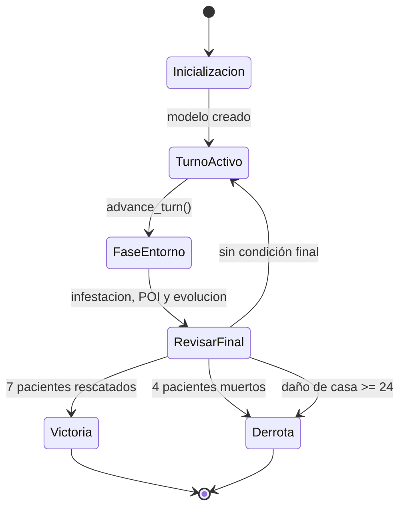

# Estado del juego

Este diagrama representa el ciclo que ejecuta actualmente `PlagueSimulationModel`.

En el código actual, `advance_turn()` incrementa el turno y ejecuta la fase de entorno. La activación secuencial de los médicos es comportamiento propuesto para la siguiente etapa.
