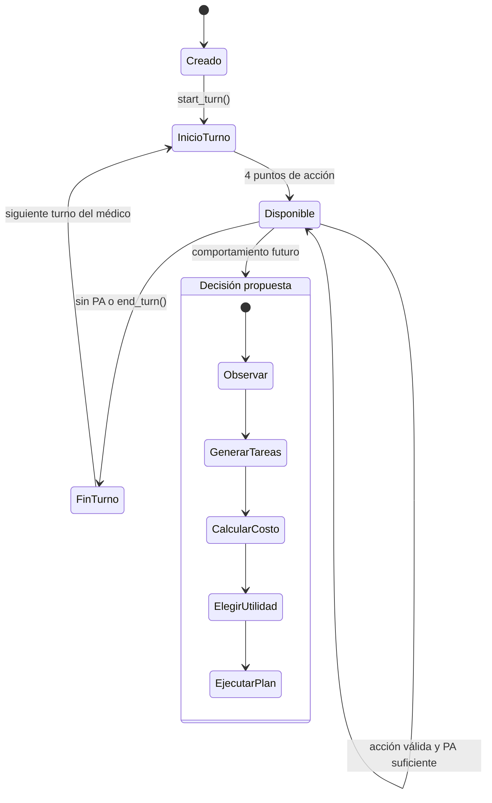

# Estado del agente

El manejo de puntos de acción y fin de turno ya existe. La selección automática de tareas aún es una propuesta: `PlagueDoctorAgent.step()` no tiene comportamiento implementado.

Las acciones propuestas usan los costos centralizados en `PlagueDoctorAgent.ACTION_COSTS`.
