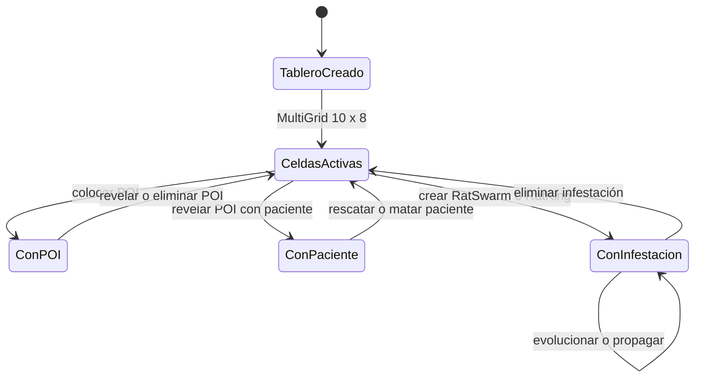

# Estado del tablero

El tablero es una cuadrícula Mesa de 10 por 8. Las entidades se colocan en celdas; muros y puertas se almacenan entre celdas en `boundaries`.

Los cambios de los límites del tablero se detallan por separado en [Puertas y muros](./06-puertas-y-muros.md).
