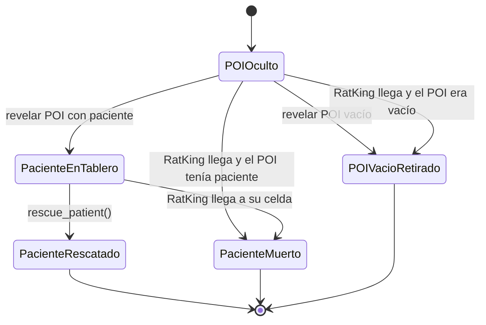

# Estados de POI y pacientes

Un POI conserva si oculta un paciente. Al revelarse, se elimina del tablero; solo crea un paciente cuando `has_patient` es verdadero.

La recogida y el transporte por un médico están planeados, pero todavía no existen como acciones implementadas.
