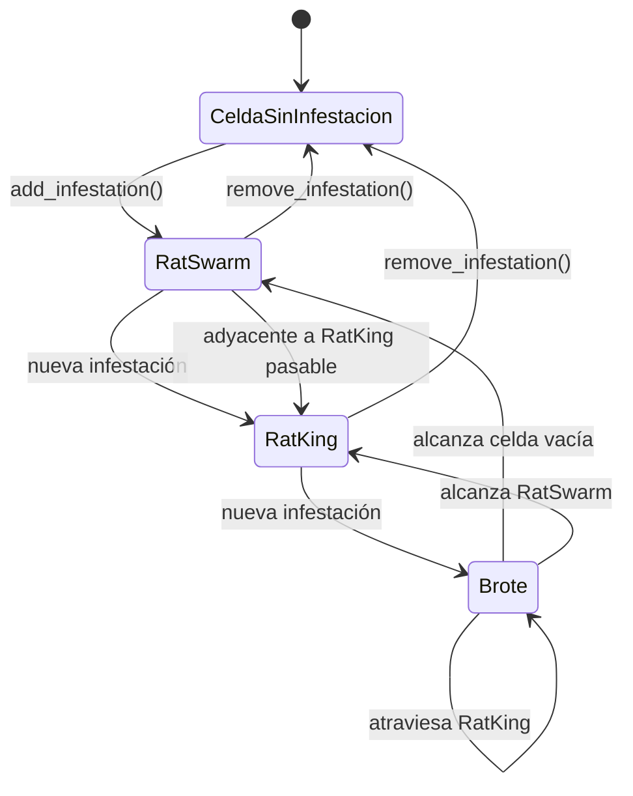

# Estados de la infestación

La infestación comienza en una celda vacía como `RatSwarm`. Una nueva infestación en esa misma celda la convierte en `RatKing`; una nueva infestación sobre un RatKing inicia un brote.

Durante un brote, un límite bloqueante recibe daño. Un muro destruido permite continuar el brote; una puerta destruida absorbe esa dirección del brote.
