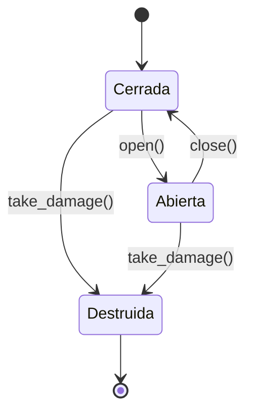
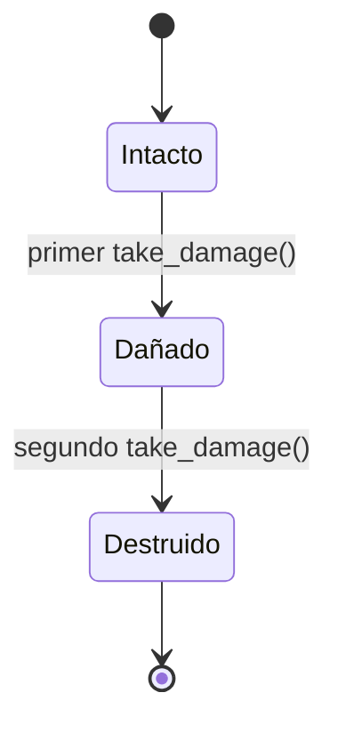

# Estados de puertas y muros

Muros y puertas viven entre dos celdas. Un límite solo es atravesable cuando su propiedad `is_passable` es verdadera.

## Puerta

Una puerta destruida queda abierta al paso y añade 2 puntos al daño de la casa.

## Muro

Un muro destruido queda abierto al paso. Cada impacto añade 1 punto al daño de la casa.
