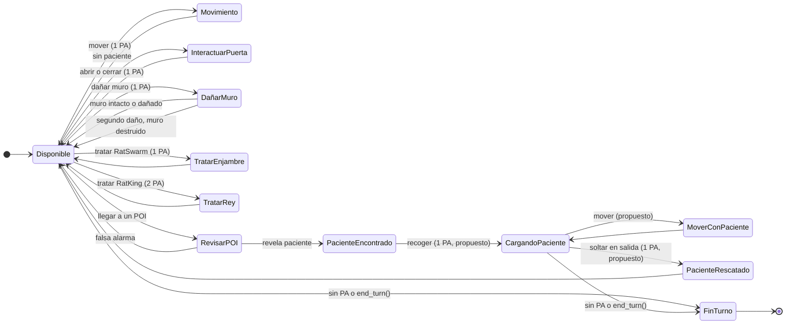

# Acciones y estados del médico de la peste

Este diagrama se inspira en las acciones del bombero del modo familiar de *Flash Point: Fire Rescue*, pero usa la adaptación actual de Plague Point. Los costos vienen de `PlagueDoctorAgent.ACTION_COSTS`.

## Correspondencia con el modo familiar de Flash Point

| Bombero en el modo familiar | Adaptación Plague Point | Estado actual |
| --- | --- | --- |
| Mover una casilla (1 PA) | Mover una casilla (1 PA) | Costo definido; ejecución del médico pendiente. |
| Entrar a un POI y revelarlo | Llegar al POI y revelarlo | `reveal_poi()` ya existe en el modelo; el médico aún no la invoca. |
| Abrir/cerrar puerta (1 PA) | Abrir/cerrar puerta (1 PA) | Costos definidos; ejecución pendiente. |
| Llevar víctima | Recoger, mover cargando y soltar/rescatar paciente | Recoger/soltar están definidos como costos; transporte y salida están pendientes. |
| Apagar humo/fuego | Tratar RatSwarm/RatKing | Equivalencia temática propuesta: 1 PA y 2 PA, respectivamente. |
| Cortar un muro (2 PA) | Dañar un muro dos veces (1 PA + 1 PA) | La transición de daño/destrucción está implementada en `Wall`. |

El modo familiar permite guardar PA no usados y contempla que un bombero sea derribado. La adaptación actual reinicia a 4 PA en `start_turn()` y todavía no implementa un estado de derribo, por eso esos elementos no se muestran como acciones del médico.
